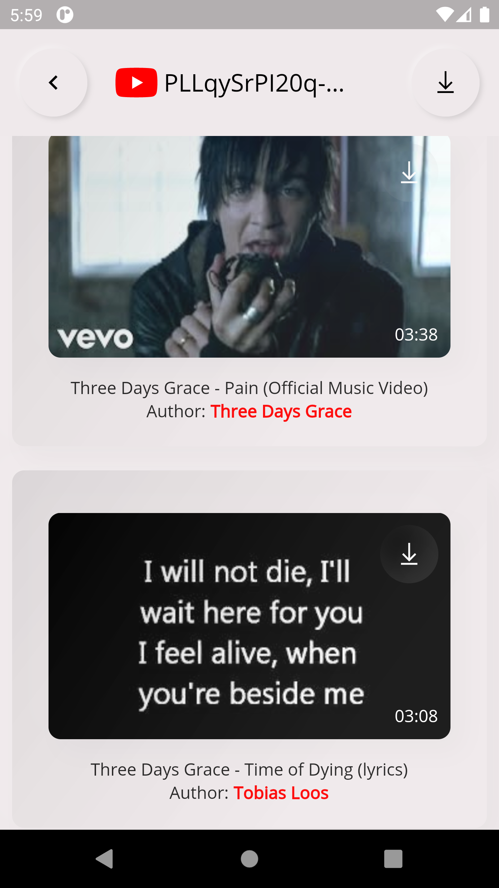

#  

**Y2D** : A open-source YouTube Downloader App built in [Flutter](https://github.com/flutter/flutter)

[TOC]

***

# Download

Download Link :  

## Features

- Download YouTube Videos Thumbnail (High/Medium/Low)
- Download Only *Video / Audio* from YouTube
- Download Full Videos from YouTube
- Download Video from Playlist / Channel

##  Screenshots

## Questions & Answers 

- **Where's my downloaded videos/thumbnail/audios ?**

  All downloaded items are in the External Storage  `Download` folder.

- **Channel ID search not working?**

  First of all, channel and user id are different.

  Here's how chennel id looks like: 

  Here's how User id looks like:

  In this app you have to paste channel ID not user ID. You can search user ID in the *search video* tab and get all his channel videos.

- How do i search playlist?

  You can just paste the playlist id in *search playlist* tab

  

  Here's the above playlist id : `PLLqySrPI20q-kcFreUhiQG_xfX3YqqKUi`

  

Tutorial : https://www.youtube.com/watch?v=F5usT0HEmfk
